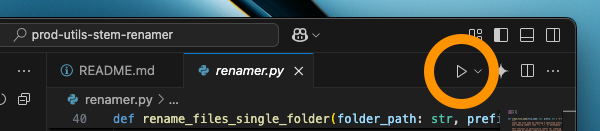
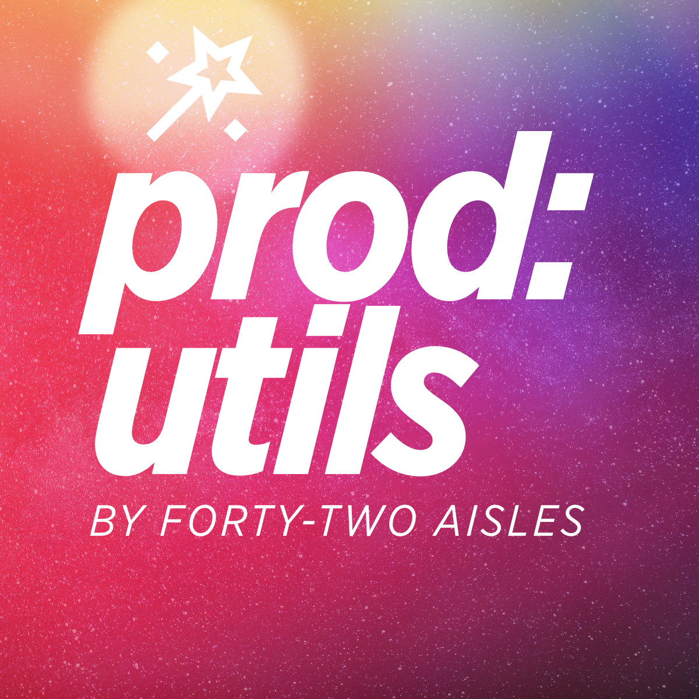

# Producer Utilities: Stems Renamer

This tool helps you quickly rename your Ableton stem files by removing unwanted prefixes and track numbers added during export. It works on all audio files in a folder and its subfolders.

## Part of the Producer Utilities Toolkit by [Forty-Two Aisles](https://linktr.ee/fortytwoprod)

Feel free to DM or email me your suggestions for other boring steps in your music and content creation process to automate away! For music collaborations and K-pop pitching, contact me on [Instagram](https://www.instagram.com/fortytwoprod).

## Easy Setup Guide

1. [Download Python](https://www.python.org/downloads/), the programming language needed to run this tool.
2. Get [Visual Studio Code](https://code.visualstudio.com/), a program to open and run the code.
3. Download the tool:
    - Click the green **"Code"** button on this page.
    - Select **"Download ZIP"**.
4. Unzip the downloaded file to create a folder.
5. Open Visual Studio Code:
    - Click **"File"** > **"Open Folder..."**.
    - Select the unzipped folder and click **"Open"** (macOS) or **"Select Folder"** (Windows).
6. Open the file named `renamer.py` in Visual Studio Code.

## How to Use

1. Set the folder path where the stems are located:
    - **macOS**: Right-click a file or subfolder in the folder, select **"Get Info"**, then right-click the path next to **"Where"** and choose **"Copy as Pathname"**. Open `renamer.py`, scroll to the bottom, and paste the path into the `folder_path` line.
    - **Windows**: Right-click a file or subfolder in the folder, select **"Properties"**, highlight the path next to **"Location"**, and press **Ctrl+C** to copy. Open `renamer.py`, scroll to the bottom, and paste the path into the `folder_path` line.
2. Set the prefix to remove by editing the `prefix` line in `renamer.py`.
3. Click the Play button in Visual Studio Code to run the tool. See screenshot below.

## The MIT License

Copyright 2025 Forty-Two Aisles

Permission is hereby granted, free of charge, to any person obtaining a copy of this software and associated documentation files (the “Software”), to deal in the Software without restriction, including without limitation the rights to use, copy, modify, merge, publish, distribute, sublicense, and/or sell copies of the Software, and to permit persons to whom the Software is furnished to do so, subject to the following conditions:

The above copyright notice and this permission notice shall be included in all copies or substantial portions of the Software.

THE SOFTWARE IS PROVIDED “AS IS”, WITHOUT WARRANTY OF ANY KIND, EXPRESS OR IMPLIED, INCLUDING BUT NOT LIMITED TO THE WARRANTIES OF MERCHANTABILITY, FITNESS FOR A PARTICULAR PURPOSE AND NONINFRINGEMENT. IN NO EVENT SHALL THE AUTHORS OR COPYRIGHT HOLDERS BE LIABLE FOR ANY CLAIM, DAMAGES OR OTHER LIABILITY, WHETHER IN AN ACTION OF CONTRACT, TORT OR OTHERWISE, ARISING FROM, OUT OF OR IN CONNECTION WITH THE SOFTWARE OR THE USE OR OTHER DEALINGS IN THE SOFTWARE.

